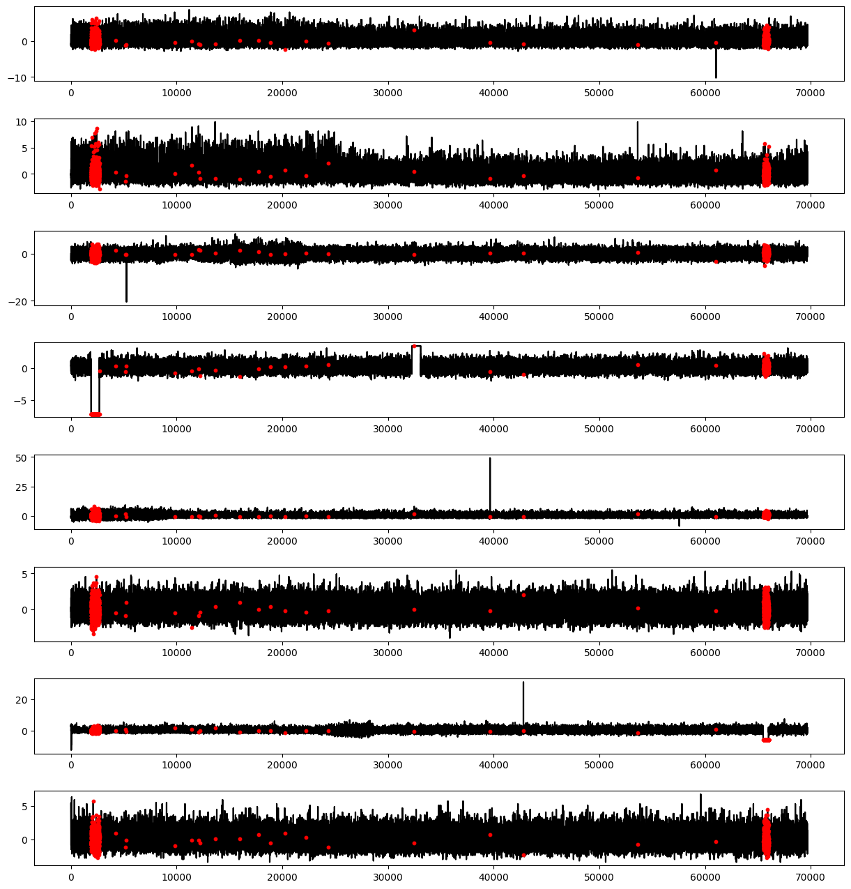

### MTAD-GAT
**GNN (Graph Neural Network) based Hybrid Model**

github : https://github.com/ML4ITS/mtad-gat-pytorch.git

---

### Dataset

**∷ <span style="background-color:#fff5b1">*datasets > data_format.py</span>***

```docker
python data_format.py <point1_path> <point2_path> <output_name> <save_file_format>
```

- < point1_path > : point1 data **folder** path
- < point2_path > : point2 data **folder** path
- < output_name > : save file path (name)
- < save_file_format > : save file format ( **cvs / pkl / mat** )

<br/>

*>>  prestosolution data : mat to **pkl***


```docker
python data_format.py P1 P2 data/train pkl
```

<br/>

### Train

**∷ *<span style="background-color:#fff5b1">train.py</span>***

```docker
python train.py --dataset <dataset> --epochs <epochs>
```
<br/>

*>>  prestosolution data & epochs 100*

```docker
python train.py --dataset **PRESTO** --epoch 100
```

<br/>

### TEST

**∷ *<span style="background-color:#fff5b1">test.ipynb</span>***

